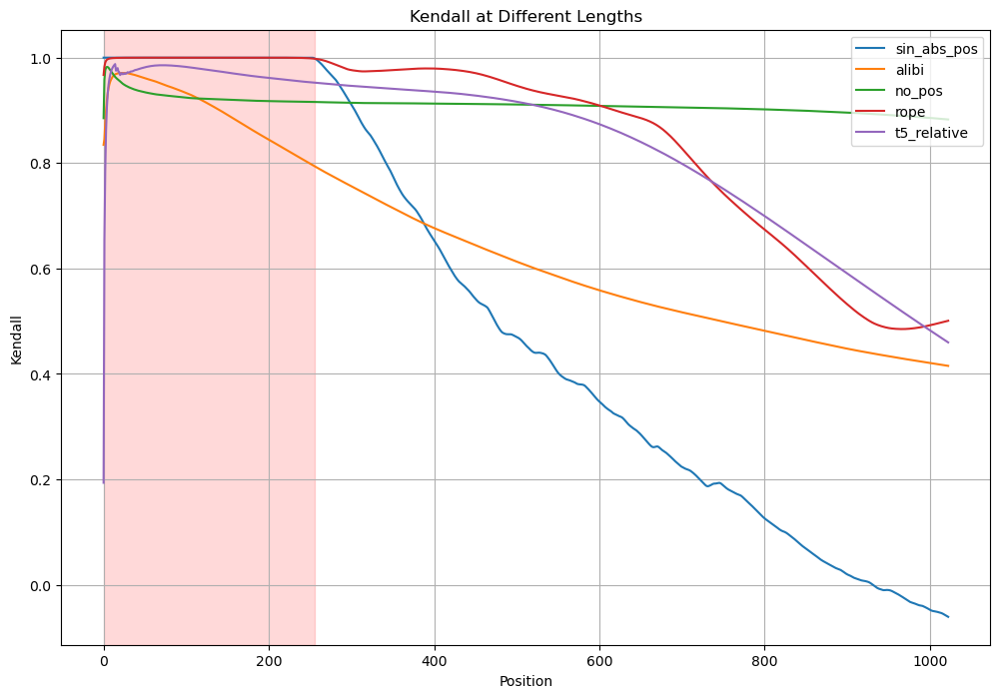
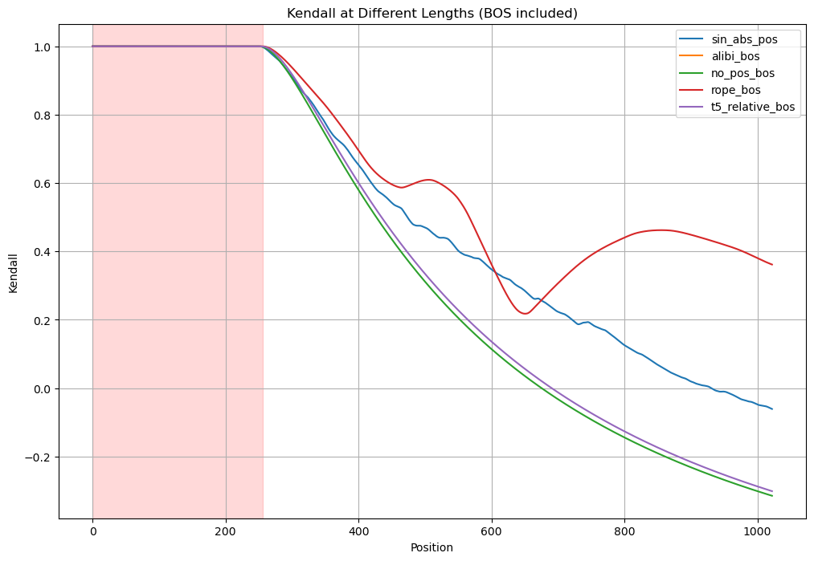
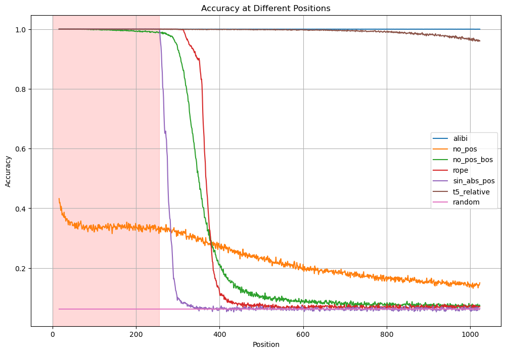

# Does Positionl Encoding Matter?

This project stems from discussions in NLP lectures regarding the properties of various positional encodings (PEs), specifically how the performance of transformers is influenced by different PEs. To explore this question, I examine how transformer models, consisting only of decoders and trained on synthetic data with small context sizes, perform when applied to larger context sizes. This line of inquiry falls under the category of _length generalization_ in the literature.

Recent studies indicate that decoder-only models with different positional embeddings yield varying levels of performance on synthetic tasks outside the training context. My research largely builds upon the findings of {article}, with two key distinctions:

1. **Focus on Non-Permutation-Invariant Tasks**: I concentrate exclusively on tasks where the target output is not invariant under permutations of the input sequence. This emphasis ensures that the tasks inherently require the use of position information.
2. **Inclusion of Begin-of-Sequence (BOS) Token**: For models with relative positional encoding, I further investigate the effect of substituting a begin-of-sequence (BOS) token at the start of the input sequence. This addition allows me to empirically test the hypothesis that the BOS token enables models to learn absolute positional encodings.

My findings corroborate most of the conclusions presented in {article}, with two notable exceptions. First, models without positional encodings (NoPE) do not outperform those with other PEs on synthetic tasks, contrary to prior claims. Second, introducing a BOS token causes the models' behavior to align closely with that of standard absolute positional encodings (APE).

# Predict Position (Ranking)

# Induction 

# Addition 

# SCAN 